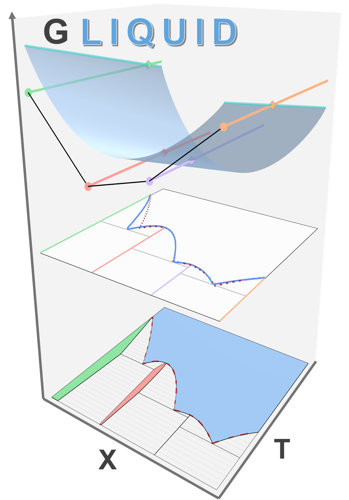

#  
# GLiquid: DFT-Referenced Thermodynamic Modeling

[](LICENSE)

[](https://colab.research.google.com/github/willwerj/gliquid_python/blob/main/notebooks/colab_demo.ipynb)

## Overview
**GLiquid** is a Python-based tool designed for fitting **DFT-referenced liquid free energies** for the thermodynamic
modeling of two-component systems. It integrates **Jupyter notebooks**, interactive **Plotly visualizations**, and 
the **Materials Project API** to seamlessly fit and adjust non-ideal mixing parameters to describe the liquid phase. 
Future versions will support the use of fitted binary liquid free energies to interpolate multicomponent phase diagrams

## Installation & Setup
### **1. Clone the Repository**
Open your terminal and clone the repository to the folder where you want to store it locally. This step can also be 
done through downloading the zip file and unpacking it to your local directory
```bash
cd "some_local_directory"
git clone https://github.com/willwerj/gliquid_python.git
cd gliquid_python
```

### **2. Create an Environment**
If you use a `conda` environment manager:
```bash
conda create --name gliquid-env python=3.10  # Python 3.11 and 3.12 also supported
conda activate gliquid-env
```
or if using `venv`:
```bash
# Linux Shell:
py -3.10 -m venv gliquid-env
source gliquid-env/bin/activate
```
      
```bash   
# Windows Powershell:                                                                
py -3.10 -m venv gliquid-env
Set-ExecutionPolicy -ExecutionPolicy RemoteSigned -Scope Process # As needed                                                
gliquid-env\Scripts\Activate.ps1      
```                       
                                                          
### **3. Install GLiquid**
Install the package from the repository root.

Base installation:
```bash
pip install .
```

If you want to retrieve **live MPDS phase-diagram data** instead of using only cached/local files, install the optional
MPDS extra:

```bash
pip install .[mpds]
```

For development work, you may prefer an editable install:

```bash
pip install -e .
```

> Note: Jupyter is not installed in the base package dependencies. If you want local notebook tooling outside Colab, install:
>
> ```bash
> pip install .[notebook]
> ```

### **4. Configure API Keys**
#### Materials Project
Visit the [Materials Project Website](https://next-gen.materialsproject.org/api) and create an account if you don't
already have one. You will need an API key for fetching DFT data that is not already cached locally.

You can set it in Python:

```python
import os
os.environ["NEW_MP_API_KEY"] = "YOUR_API_KEY_HERE"
```

#### MPDS (optional)
MPDS access is only needed when you want to download live MPDS phase-diagram data. If you are working from cached
JSON files, you do **not** need `mpds-client` or an MPDS key.

If you install the optional extra, set:

```python
import os
os.environ["MPDS_API_KEY"] = "YOUR_MPDS_API_KEY_HERE"
```

## Quick Start
The example below mirrors the core workflow shown in the fitting demo notebook: load a cached binary system,
fit liquid non-ideal mixing parameters, and visualize the resulting phase diagram.

```python
import os

os.environ["NEW_MP_API_KEY"] = "YOUR_API_KEY_HERE"

from gliquid.binary import BinaryLiquid, BLPlotter

# Build a BinaryLiquid object from cached MPDS / DFT data
bl = BinaryLiquid.from_cache("Cu-Mg", param_format="comb-exp")

# Fit liquid non-ideal mixing parameters
fit_results = bl.fit_parameters(verbose=True, n_opts=5)
best_fit = min(fit_results, key=lambda result: result.get("mae", float("inf")), default={})

print("Best-fit result:")
for field, value in best_fit.items():
    print(f"  {field}: {value}")

# Visualize the fitted phase diagram and the DFT convex hull + liquid free energy
plotter = BLPlotter(bl)
plotter.show("fit+liq")
plotter.show("ch+g")
```

For a more detailed walkthrough, including raw data inspection and batch fitting across multiple systems, see
[notebooks/fitting_demo.ipynb](notebooks/fitting_demo.ipynb).

## Google Colab
For a ready-to-run Colab workflow, use [notebooks/colab_demo.ipynb](notebooks/colab_demo.ipynb).

Key points for Colab use:
- `data/` remains external to the package and should be provided from a cloned repository (or your own mounted path).
- Prefer setting the data path in Python with `cfg.set_data_dir(...)` (no `GLIQUID_DATA_DIR` required).
- `scikit-learn` and `xgboost` remain pinned in package dependencies for compatibility with serialized production model artifacts.

Typical Colab setup:

```python
!git clone https://github.com/willwerj/gliquid_python.git
%cd /content/gliquid_python
!pip install .
```

```python
import os
from pathlib import Path
import gliquid.config as cfg
os.environ["NEW_MP_API_KEY"] = "YOUR_API_KEY_HERE"
cfg.set_data_dir(Path("/content/gliquid_python/data").resolve())
```

## Usage
If using `jupyter`, first register your environment as a notebook kernel. Then navigate
to the [notebooks](notebooks) directory and launch Jupyter. If your IDE already supports notebooks,
you can instead select the same environment directly in the editor.

```bash
# Run these only if using Jupyter notebooks
python -m ipykernel install --user --name=gliquid-env
cd notebooks
jupyter notebook
```

## Contributing

Pull requests are welcome. For major changes, please open an issue first
to discuss what you would like to change.

## License

[MIT](LICENSE)
