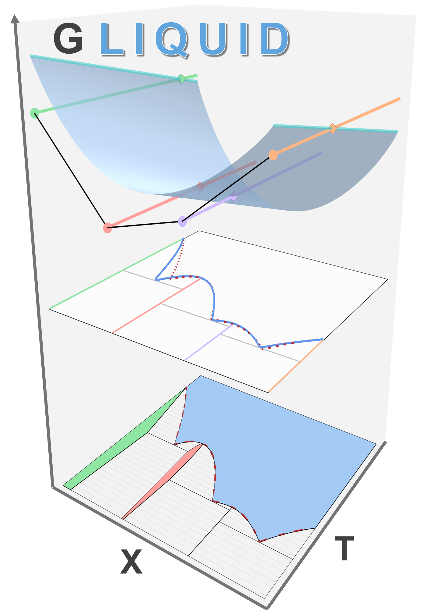

#  
# GLiquid: DFT-Referenced Thermodynamic Modeling

[](LICENSE)

[](https://colab.research.google.com/github/willwerj/gliquid_python/blob/main/notebooks/colab_demo.ipynb)

## Overview
**GLiquid** is a Python-based tool designed for fitting **DFT-referenced liquid free energies** for the thermodynamic
modeling of two-component systems. It integrates **Jupyter notebooks**, interactive **Plotly visualizations**, and 
the **Materials Project API** to seamlessly fit and adjust non-ideal mixing parameters to describe the liquid phase. 
Future versions will support the use of fitted binary liquid free energies to interpolate multicomponent phase diagrams

## Installation & Setup
### **1. Install GLiquid**
GLiquid is on PyPI:

```bash
pip install gliquid
```

That is the whole installation. The unary reference tables ship inside the package, so element
free energies work immediately (see step 3); the per-system **data corpus** is external and is
what step 2 is for.

Optional extras:

```bash
pip install gliquid[mpds]      # retrieve live MPDS phase-diagram data, not just cached files
pip install gliquid[editor]    # the interactive ConvexHullEditor (ipywidgets)
pip install gliquid[models]    # exact scikit-learn / xgboost versions the serialized
                               # production model artifacts were pickled against
pip install gliquid[notebook]  # local Jupyter tooling -- not a base dependency
```

Python 3.10–3.13 are supported. Installing into an isolated environment is recommended.
With `conda`:

```bash
conda create --name gliquid-env python=3.10  # 3.11, 3.12 and 3.13 also supported
conda activate gliquid-env
```

or with `venv`:

```bash
# Linux Shell:
py -3.10 -m venv gliquid-env
source gliquid-env/bin/activate
```

```bash   
# Windows Powershell:                                                                
py -3.10 -m venv gliquid-env
Set-ExecutionPolicy -ExecutionPolicy RemoteSigned -Scope Process # As needed                                                
gliquid-env\Scripts\Activate.ps1      
```                       

### **2. Clone the repository — for the data corpus, the notebooks, or development**
A `pip install` gets you the library. Clone the repository when you want the external data
corpus (the per-system DFT caches and digitized phase diagrams), the demonstration notebooks, or
a checkout to develop against:

```bash
cd "some_local_directory"
git clone https://github.com/willwerj/gliquid_python.git
cd gliquid_python
```

From a clone you can install the checkout itself, in place of the PyPI release:

```bash
pip install .        # the checkout, as a normal install
pip install -e .     # editable, for development
pip install -e .[test]  # editable, plus pytest and ruff -- see CONTRIBUTING.md
```

A clone also needs no data configuration: GLiquid falls back to the checkout's own `data/`
directory. See step 3.

### **3. Point GLiquid at its data**
GLiquid's data comes in two kinds, and only one of them is installed with the package.

**Reference tables — shipped, nothing to do.** `phase_transitions.json` (the unary element
database), `omegas_hcp.json` and `spurious_structures.json` live inside the package at
`gliquid/data/`. They are what element free-energy references are built from, so a
`pip install gliquid` is immediately able to compute:

```python
from gliquid import phase
print(phase.UNARY["Fe"].t_fusion)   # 1811.0 — works straight after pip install
```

**The data corpus — external, you provide it.** The per-system DFT entry caches
(`<System>_ENTRIES_MP_GGA.json`), the digitized MPDS phase diagrams and the trained model
bundle are megabytes of per-system data that no distribution carries. Anything that reads a
cached system needs a data directory. Point at one either way:

```python
from pathlib import Path
import gliquid.config as cfg
cfg.set_data_dir(Path("/path/to/gliquid_python/data"))
```

```bash
export GLIQUID_DATA_DIR=/path/to/gliquid_python/data   # read once, at import
```

The resolution order is `set_data_dir()`, then `GLIQUID_DATA_DIR`, then — if you are running
from a source checkout — that checkout's own `data/`. Working from a clone therefore needs no
configuration at all. With none of the three available, a call that needs the corpus raises
`gliquid.ConfigError` naming both remedies; it will **not** guess a directory, because a
guessed path yields an empty registry and results that are quietly zero rather than wrong
loudly.

Each of the three reference tables is taken from your data directory when a file of that name
exists there, and from the shipped copy otherwise — so a directory holding only per-system
caches still works, and dropping an edited `phase_transitions.json` beside them still
overrides the shipped one.

### **4. Configure API Keys**
#### Materials Project
Visit the [Materials Project Website](https://next-gen.materialsproject.org/api) and create an account if you don't
already have one. You will need an API key for fetching DFT data that is not already cached locally.

You can set it in Python:

```python
import os
os.environ["NEW_MP_API_KEY"] = "YOUR_API_KEY_HERE"
```

> **`dft_type` supports `GGA` only in 0.1.0.** `R2SCAN` and `MIXED` are still recognized names,
> but both are blocked by upstream bugs (an `emmet-core` thermo-type casing mismatch and an
> unhashable `entry_id` in pymatgen's mixing scheme), so they raise a `ValueError` naming the
> cause instead of fetching. Every cached diagram and published result uses `GGA`.

#### MPDS (optional)
MPDS access is only needed when you want to download live MPDS phase-diagram data. If you are working from cached
JSON files, you do **not** need `mpds-client` or an MPDS key.

If you install the optional extra, set:

```python
import os
os.environ["MPDS_API_KEY"] = "YOUR_MPDS_API_KEY_HERE"
```

## Quick Start
The example below mirrors the core workflow shown in the fitting demo notebook: load a cached binary system,
fit liquid non-ideal mixing parameters, and visualize the resulting phase diagram.

```python
import os

os.environ["NEW_MP_API_KEY"] = "YOUR_API_KEY_HERE"

from gliquid.binary import BinaryLiquid, BLPlotter

# Build a BinaryLiquid object from cached MPDS / DFT data
bl = BinaryLiquid.from_cache("Cu-Mg", param_format="comb-exp")

# Fit liquid non-ideal mixing parameters
fit_results = bl.fit_parameters(verbose=True, n_opts=5)
best_fit = min(fit_results, key=lambda result: result.get("mae", float("inf")), default={})

print("Best-fit result:")
for field, value in best_fit.items():
    print(f"  {field}: {value}")

# Visualize the fitted phase diagram and the DFT convex hull + liquid free energy
plotter = BLPlotter(bl)
plotter.show("fit+liq")
plotter.show("ch+g")
```

For a more detailed walkthrough, including raw data inspection and batch fitting across multiple systems, see
[notebooks/fitting_demo.ipynb](notebooks/fitting_demo.ipynb).

## Google Colab
For a ready-to-run Colab workflow, use [notebooks/colab_demo.ipynb](notebooks/colab_demo.ipynb).

Key points for Colab use:
- The reference tables ship with the package; the **data corpus** does not, and must come from
  a cloned repository or your own mounted path (see step 3 above).
- Either `cfg.set_data_dir(...)` in Python or `os.environ["GLIQUID_DATA_DIR"] = ...` before
  importing `gliquid` will do. The Python call is easier to see and to change in a notebook.
- `scikit-learn` and `xgboost` are version-*ranged* in the base dependencies. If you load the
  serialized production model artifacts, install `gliquid[models]`, which pins the exact
  versions they were written with.

Typical Colab setup:

```python
!git clone https://github.com/willwerj/gliquid_python.git
%cd /content/gliquid_python
!pip install .
```

```python
import os
from pathlib import Path
import gliquid.config as cfg
os.environ["NEW_MP_API_KEY"] = "YOUR_API_KEY_HERE"
cfg.set_data_dir(Path("/content/gliquid_python/data").resolve())
```

## Usage
If using `jupyter`, first register your environment as a notebook kernel. Then navigate
to the [notebooks](notebooks) directory and launch Jupyter. If your IDE already supports notebooks,
you can instead select the same environment directly in the editor.

```bash
# Run these only if using Jupyter notebooks
python -m ipykernel install --user --name=gliquid-env
cd notebooks
jupyter notebook
```

## Logging

GLiquid reports its progress, warnings and recoverable errors through the standard `logging`
module, under the `gliquid` logger (one child logger per module, e.g. `gliquid.binary`,
`gliquid.solution`).

Like any library, **GLiquid installs no handlers and sets no levels of its own** — it never calls
`logging.basicConfig()`. That keeps the choice of where output goes with the application, but it
also means that by default you see nothing except warnings and errors, which Python's last-resort
handler prints to `stderr`.

To get the fitting/plotting progress messages (the print-era behaviour), attach a handler once:

```python
import logging

logging.getLogger("gliquid").setLevel(logging.INFO)
logging.getLogger("gliquid").addHandler(logging.StreamHandler())
```

Useful variations:

```python
# Everything, with timestamps and the emitting module, into a file
import logging

handler = logging.FileHandler("gliquid.log", encoding="utf-8")
handler.setFormatter(logging.Formatter("%(asctime)s %(name)s %(levelname)s %(message)s"))
gliquid_log = logging.getLogger("gliquid")
gliquid_log.setLevel(logging.DEBUG)   # DEBUG adds the "why did it draw nothing here?" detail
gliquid_log.addHandler(handler)

# Quieten one noisy module without silencing the rest
logging.getLogger("gliquid.solution").setLevel(logging.ERROR)
```

Note that several long-running entry points (`BinaryLiquid.fit_parameters`,
`find_invariant_points`, ...) also take a `verbose=` flag. That flag gates *whether* the
per-iteration messages are emitted at all; the logger configuration above decides where the
emitted ones go. Both have to be on to see them.

## Running the tests

From a clone with `pip install -e .[test]`, `pytest` at the repository root runs the public
suite. `pytest tests_internal` adds the maintainer tier (value pins, figure goldens, and
families gated on the data cache or a live API key), and `pytest tests tests_internal` runs
everything — which is what CI runs.

Use `pytest -m "not slow"` for the fast loop. The markers, the pin re-freezing rule and the
rest of the developer workflow are documented in [CONTRIBUTING.md](CONTRIBUTING.md).

## Contributing

Pull requests are welcome. For major changes, please open an issue first
to discuss what you would like to change. See [CONTRIBUTING.md](CONTRIBUTING.md) for
environment setup, how to run each test tier, the formatting rules, the print/logging boundary
the test suite enforces, and the release checklist.

## Citing

If GLiquid contributes to work you publish, please cite it. GitHub's "Cite this repository"
button reads [CITATION.cff](CITATION.cff) in this repository, which carries the authors, the
version and the release date in both APA and BibTeX form.

## Changelog

Release history lives in [CHANGELOG.md](CHANGELOG.md).

## License

[MIT](LICENSE)


## Acknowledgements

This project is made possible by funding from the U.S. Department of Energy (DOE) Office of Science, Basic Energy Sciences Award No. DE-SC0021130 and the National Science Foundation (NSF) Award No. OAC-2209423.